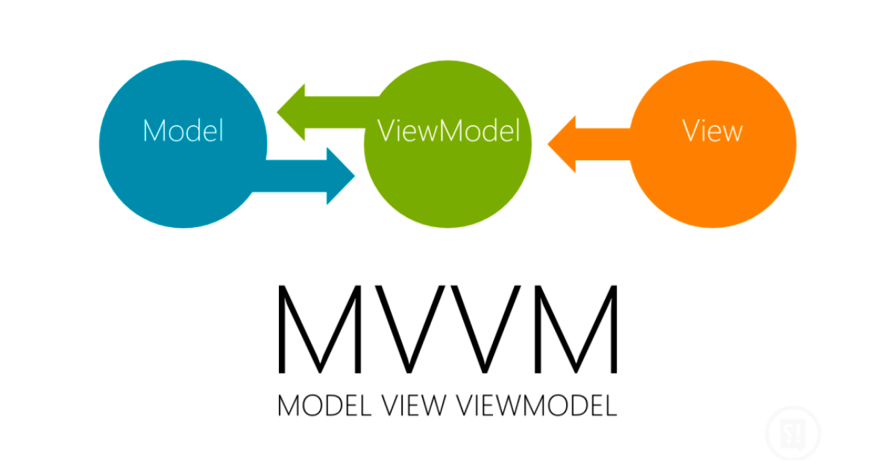
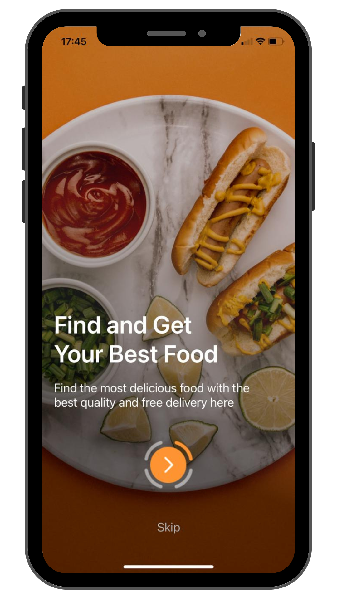
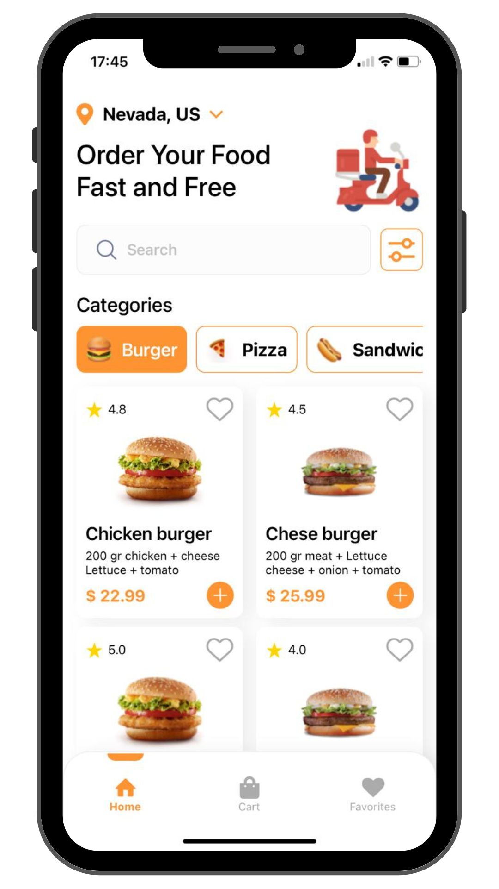
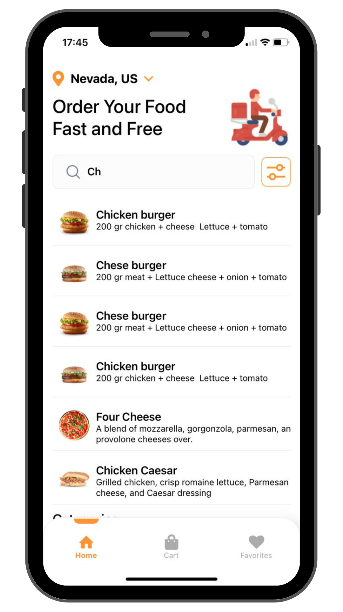
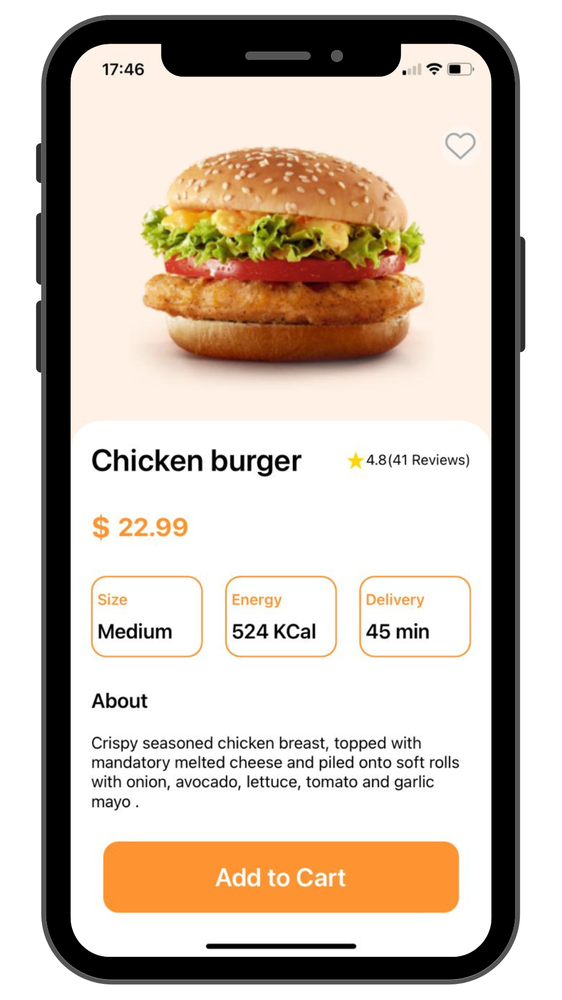
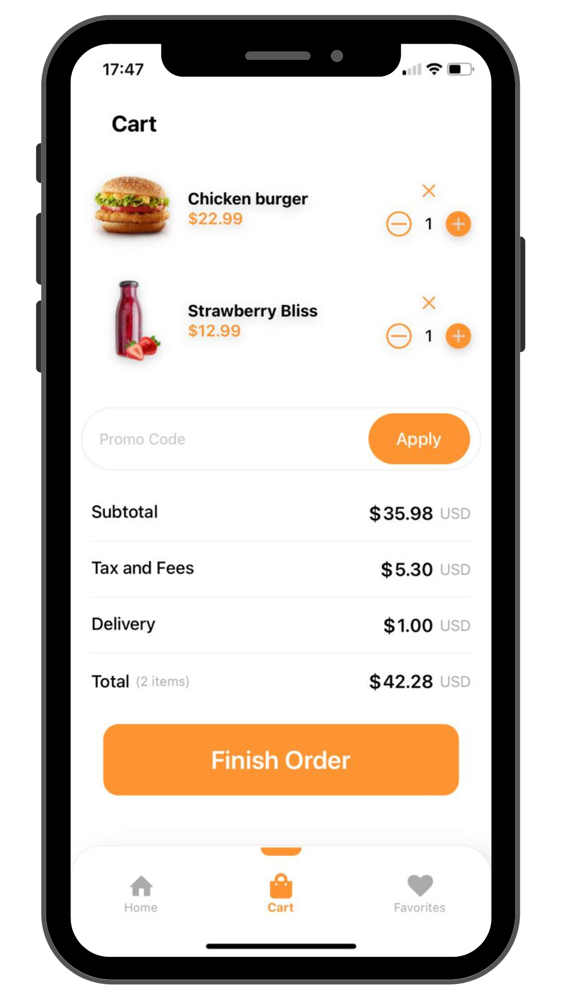
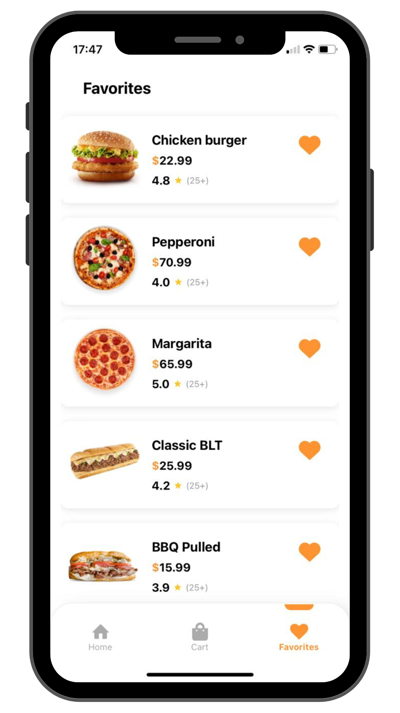

 

<p align="center">
  <a href="https://github.com/Denisson-Pereira/food-delivery"></a>
  <a href="https://github.com/Denisson-Pereira/food-delivery/issues"></a>
  <a href="https://github.com/Denisson-Pereira/food-delivery/graphs/contributors"></a>
  <a href="https://github.com/Denisson-Pereira/food-delivery/commits/main"></a>
  <a href="https://github.com/Denisson-Pereira/food-delivery/stargazers"></a>
</p>

# 📝 Sumário

1. [Sobre o Projeto](#-sobre-o-projeto)
2. [Arquitetura de software](#-arquitetura-de-software)
3. [Stack Tecnológica e Descrições](#-stack-tecnológica-e-descrições)
   - [Backend](#-backend)
   - [Banco de Dados](#-banco-de-dados)
   - [Frontend](#-frontend)
   - [Design](#-design)
4. [Pré-requisitos](#-pré-requisitos)
5. [Como Executar o Projeto](#-como-executar-o-projeto)
   - [Clonar Repositório Git](#-clonar-repositório-git)
   - [Acessar Backend](#-acessar-backend)
6. [Visuals and Screenshots](#-visuals-and-screenshots)
   - [Software em Ação](#-software-em-ação)
7. [Edição](#-edição)   
8. [Aguarde! Ainda Não Terminou!](#-aguarde-ainda-não-terminou)
9. [Licença](#-licença)
10. [Design Credits](#-design-credits)
11. [Referências Bibliográficas](#-referências-bibliográficas)

# 📑 Sobre o projeto 

O **Food Delivery** é um projeto *Full Stack* de um aplicativo de *delivery*, desenvolvido a partir de um design previamente criado no Figma por **Mohammad Mahdi**. O *backend* foi estruturado com a arquitetura **MVC (Model-View-Controller)**, utilizando a linguagem **Java** e o *framework* **Spring Boot**, garantindo robustez e escalabilidade. Para o armazenamento de dados, foi utilizado o banco de dados **MySQL**, assegurando confiabilidade no gerenciamento das informações. Já o *frontend* foi desenvolvido com **React Native**, seguindo a arquitetura **MVVM (Model-View-ViewModel)**, proporcionando uma experiência de usuário fluida e intuitiva em dispositivos móveis.

# 🏢 Arquitetura de software

No **backend** do Food Delivery, foi utilizada a arquitetura **MVC (Model-View-Controller)**, que organiza o sistema em três camadas principais. O **Model** é responsável pelo gerenciamento dos dados e das regras de negócio, o **View** se encarrega de apresentar os dados de forma visual ou em formato apropriado, enquanto o **Controller** atua como intermediário, processando as requisições e enviando as respostas adequadas. Essa separação, implementada com **Java** e o *framework* **Spring Boot**, proporciona um sistema modular, escalável e de fácil manutenção, garantindo eficiência no gerenciamento de produtos, categorias e pedidos.



Já no **frontend**, o padrão **MVVM (Model-View-ViewModel)** foi adotada para garantir uma clara separação entre a lógica de negócios e a interface do usuário. A **View** é responsável apenas por renderizar a interface e interagir com o usuário, enquanto a **ViewModel** gerencia o estado da aplicação e encapsula a lógica de negócios, conectando-se ao **Model** para acessar ou atualizar os dados. Desenvolvido com **React** **Native**, o uso do **MVVM** melhora a organização do código e facilita a manutenção, permitindo que alterações na interface não afetem a lógica subjacente, além de proporcionar uma experiência de usuário mais fluida e responsiva.

# 📚 Stack Tecnológica e Descrições

## • Backend

[](https://www.java.com/)

[](https://spring.io/)


O backend deste projeto foi desenvolvido com o objetivo de fornecer dados para uma loja de alimentos. Utilizando **Java** (versão 17) e **Spring Boot**, juntamente com o **JPA**, a aplicação oferece uma estrutura robusta e escalável, permitindo o gerenciamento eficiente de produtos e categorias.

# 🚨 Atenção!

>Uso de Variáveis de Ambiente:

```
${USERNAME_BANCO}
${SENHA_BANCO}
```


## • Banco de Dados


O banco de dados `fooddelivery` contém duas tabelas: `category` e `product`.

### Tabela: category

| Campo   | Tipo         | Descrição                               |
|---------|--------------|-----------------------------------------|
| id      | int       | Identificador único da categoria        |
| name    | varchar(30) | Nome da categoria                       |
| image   | varchar(255) | URL da imagem da categoria              |


### Tabela: product

| Campo          | Tipo         | Descrição                          |
|----------------|--------------|------------------------------------|
| id             | int       | Identificador único do produto      |
| name           | varchar(30) | Nome do produto                    |
| image          | varchar(255) | URL da imagem do produto           |
| description    | varchar(255) | Descrição do produto               |
| price          | varchar(10) | Preço do produto                   |
| category       | varchar(20) | Categoria do produto               |
| evaluation     | varchar(10) | Avaliação do produto               |
| about   | varchar(255) | Outra descrição do produto |
| size   | varchar(20) | Tamanho do produto |
| energy   | varchar(20) | Calorias do produto |
| delivery          | varchar(20) | Tempo de entrega           |

# 🚨 Atenção!

>O Firebase foi utilizado exclusivamente para upload de imagens.


## • Frontend


O aplicativo foi desenvolvido utilizando **React Native**, uma abordagem que permite a construção de plataformas para **iOS** e **Android** de forma eficiente e integrada. Além disso, o aplicativo faz uso do **Context API** para gerenciar diversos aspectos do sistema, como o controle do carrinho de compras e sistema de produtos favoritos. Essa estrutura foi pensada para garantir uma experiência de uso fluida e um gerenciamento eficiente dos dados.

## • Design


[](https://canvas.instructure.com/)

O **Adobe Photoshop** foi empregado para a edição e manipulação de imagens, garantindo qualidade e profissionalismo. Além disso, **Figma** foi utilizado para usar protótipos e layouts, facilitando a visualização e a colaboração no design da interface. Para capturas de tela e materiais educacionais, recorreu-se ao **Canvas**, que oferece uma plataforma intuitiva para a criação e compartilhamento de conteúdos visuais.

# ⚙ Pré-requisitos

**Certifique-se de ter o o Java 17**

Antes de mais nada, é necessário verificar se o Java 17 está instalado em sua máquina. Você pode baixá-lo e instalá-lo a partir do site oficial da Oracle.


# 🚀 Como executar o projeto

## 👯 Clonar repositório git

```
git clone https://github.com/Denisson-Pereira/food-delivery
```

## 🏧 Acessar Backend

Após clonar o repositório, para acessar o backend, basta digitar o seguinte comando no terminal:

```
cd backend
```

Você pode rodar a aplicação com o seguinte comando:

```
mvn spring-boot:run
```

Esse comando irá compilar e rodar a aplicação diretamente no terminal.

 

## Rodar o Mobile

Após clonar o repositório, para acessar o mobile, basta digitar o seguinte comando no terminal:

```
cd mobile
```

Para ver o projeto, certifique-se de que o backend está rodando e digite:

```
npx expo start
```

Esse comando é usado para iniciar um projeto desenvolvido com Expo.

 

Lembre-se de que os dados do banco estão localizados, a partir da raiz do projeto, em `database/Dump20241113.sql`.

# 📸 Visuals and Screenshots

Dê uma espiada no nosso projeto em funcionamento e esclareça todas as suas dúvidas sobre como executá-lo!

<div style="display: flex; gap: 10px;">
    
    
    
    
    
    
</div>


## 💻 Software em Ação

 


# 📺 Edição

No desenvolvimento deste projeto, foram utilizados os seguintes editores:


# 🚨 Aguarde! Ainda não terminou!

>Este projeto está atualmente em desenvolvimento, e está sujeito a futuras atualizações e melhorias conforme evolui. Estamos trabalhando para torná-lo ainda mais robusto e funcional ao longo do tempo. Agradecemos sua paciência e interesse nesta fase inicial.

>Por fim, gostaríamos de ressaltar que este projeto não tem fins lucrativos e está aberto a contribuições de qualquer pessoa interessada em colaborar. Se você tem ideias, sugestões ou melhorias para oferecer, sinta-se à vontade para participar do desenvolvimento do projeto. Juntos, podemos criar algo incrível e beneficiar a comunidade de forma colaborativa.

# 🎨 Design Credits

[FoodHub](https://www.figma.com/community/file/1089241914900195839/food-delivery-application) Figma Community Design

# 📜 Licença

[](https://github.com/Denisson-Pereira/food-delivery/blob/main/LICENSE) 

# 📝 Referências Bibliográficas  

MARTIN, S. R. **Código Limpo: Habilidades Práticas do Agile Software**. Rio de Janeiro: Alta Books, 2011.